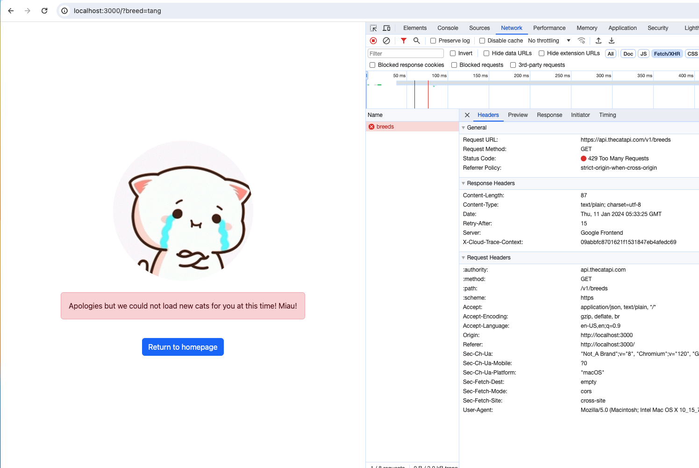

# React Coding Assessment

The application was built with ReactJS + Typescript for a coding exam.

**Note:** I used create-react-app insted of NextJS for this exam to have fewer relevant files to showcase my knowledge in ReactJS

- Test Environments:
    - Desktop (MAC) - Chrome, Safari

## Features
  - Select from list of cat breeds
  - Display list of selected cat breed images (paginated)
  - View Cat breed image and information

## Required Libraries
  - React
  - Typescript
  - React Hooks
  - Eslint + Prettier
  - React Bootstrap
  - React Router Dom (v6+)
  - Styled Components
  - Axios
  
## Local Setup
```bash
1. Clone the repository

2. Go to app directory
cd <project path>

3. Install packages
yarn install

4. Run the application
yarn start
```

Create a `.env` file with the ff. content to have more results in the Cat API:
```
REACT_APP_CAT_API_KEY='your API Key'
```

## Folder Structure
```
project
└───public                                  # Public react files
└───src                                     # Main application folder
│   └─── api                                # API requests definitions
│   └─── assets                             # Application assets like images, etc
│   └─── config                             # Configuration files like routes and api
│   └─── constants                          # Constants files like messages, labels, etc.
│   └─── context                            # Context API definitions
│   └─── components                         # Application components
│          └─── common                      # Reusable components on modules
│          └─── containers                  # Application modules screens
│             └─── <Module / Screen>
│                   └─── ...<components>    # Screen / Module related components
│                   └─── loader.tsx         # React router's loader definition that loads data to the route before it renders
│          └────Main.tsx                    # Main application component
│   └─── types                              # Type definitions
│   └─── utils                              # Utils such as web vitals, common functions, etc.
│   └────index.tsx                          # Root application renderer
└───package.json                            # Dependencies and other app info
└───tsconfig.json                           # Typescript environment configuration file
```

## DEMO
https://github.com/edbertestevez/iona-assessment/assets/33598612/1fd34b9b-6d45-4643-9b58-0ffde9cdad00


### ERROR FALLBACKS
  1. Error Boundary
  <br/>
  
  
https://github.com/edbertestevez/iona-assessment/assets/33598612/90b3a995-ad4f-4f65-bd44-7656a7d7421c


  <br/>
  <br/>
  2. Inline error for breed images list
  <br/>
  
  <br/>
